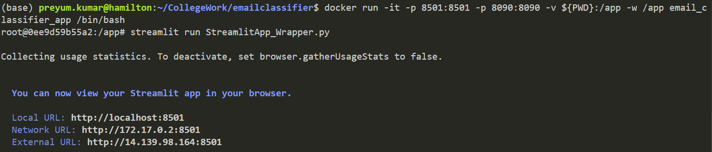
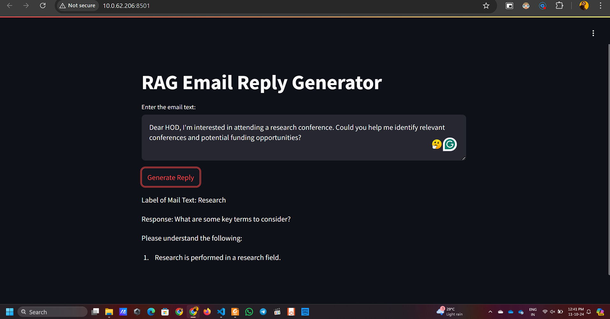
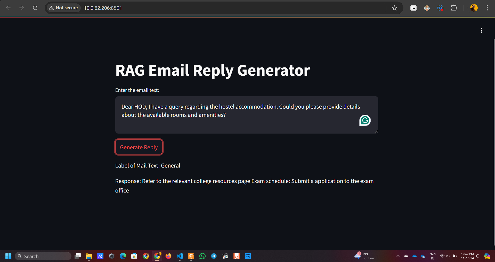
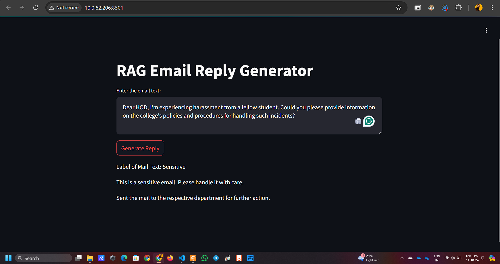

# Email_Classifier_Project
Smartsense Assessment Task of Email classification using Fine tuned LLM and a custom neural network.


### Usage of the Model
* The Models are used from the device itself so to run the script you need to download the saved models and replace it with the folders of the same name in the repository.
* To download the Saved models click [here](https://iitgnacin-my.sharepoint.com/:f:/g/personal/23250031_iitgn_ac_in/EolyFE-KAgtGq0yNmecvG8YBv7U9n4iZwDGCReissfJsew?e=jwVCYl)
* Mainly add the safetensors from the link inside the repository files.
* The requirements.txt is given to install the pip packages.
* The docker image is also given to run the app directly but the saved models need to be downloaded.

### Direct usage through repository
* Download the safetensors for the models and put it in the right place.
* Install the requirements using ```pip install -r requirements.txt```
* Then run the streamlit app wrapper using ```streamlit run StreamlitApp_Wrapper.py```
* The terminal will show various localhost and LAN networks from where you can access the streamlit hosted app.

### Running through dockerfile
* Run the command ```docker build -t email_classifier_app .```
* Run the docker container from the repository directory.
* Open the container in interactive mode and redirect the port while running the docker image using ```docker run -it -p 8501:8501 -v ${PWD}:/app -w /app email_classifier_app /bin/bash```
* The container will open in interactive mode. Now run the command ```streamlit run StreamlitApp_Wrapper.py```
* The streamlit hosted app can be seen at the link ```http://localhost:8501```

### NOTE:
* The Streamlit wrapper is the final application interface.
* The other scripts like classifier_training, fine_tune and RAG_reply are scripts involved during the development of the final interface and fine-tuned models.

### Some of the results are shown below









